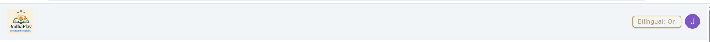
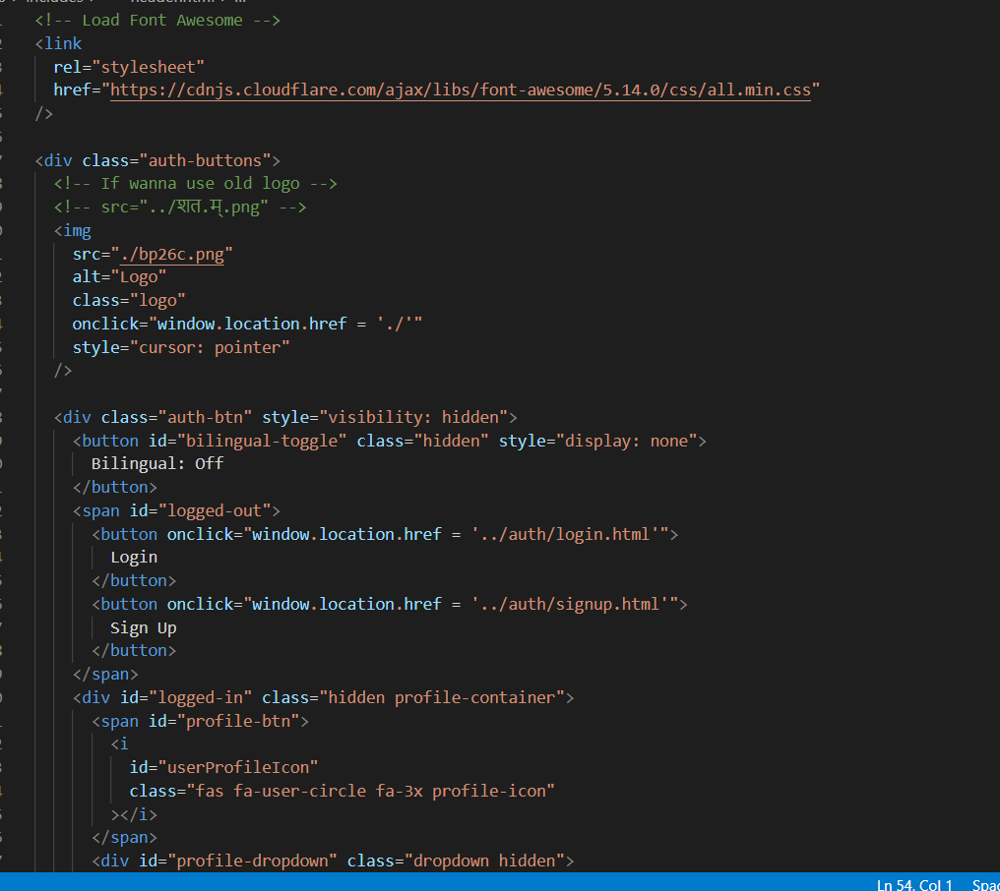
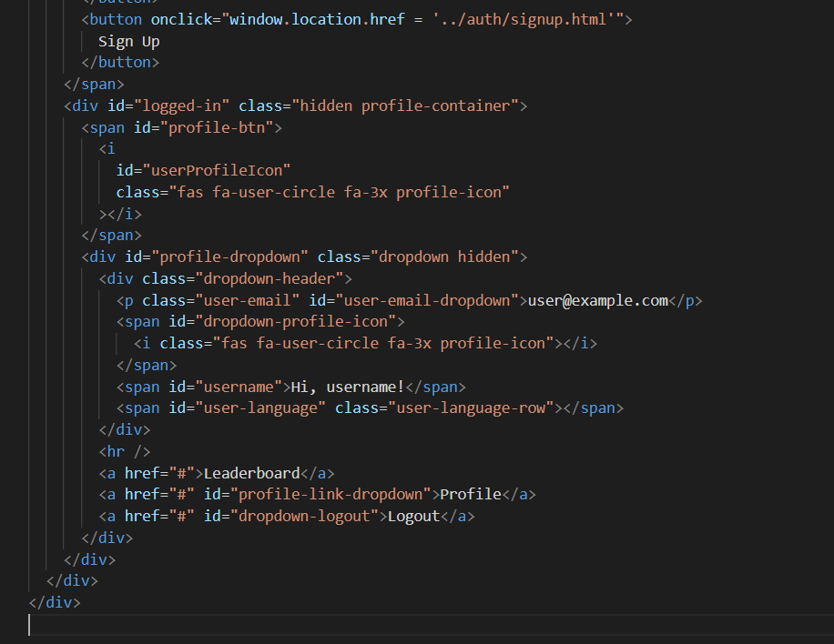
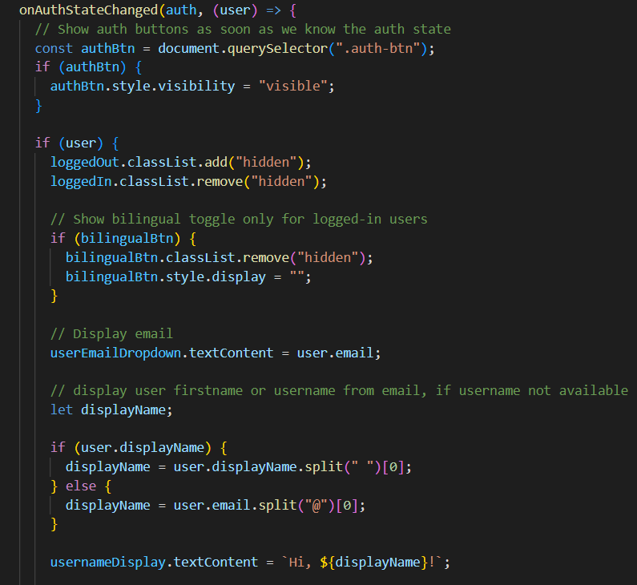
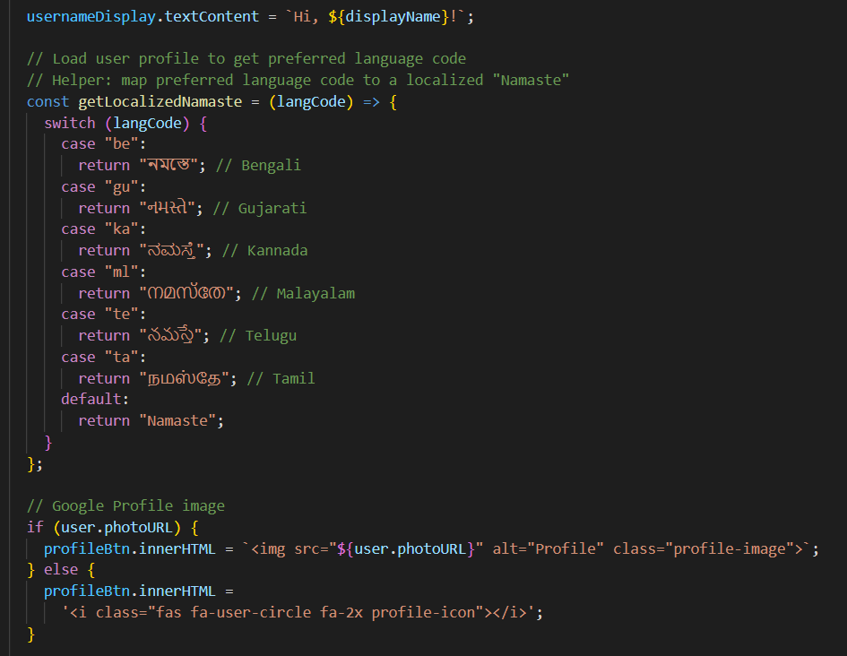
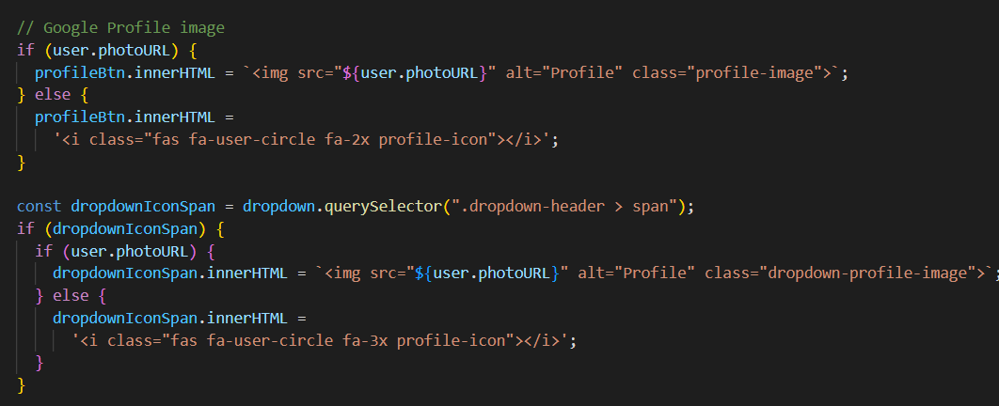
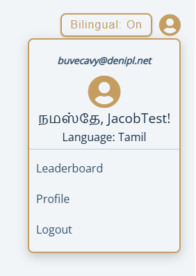
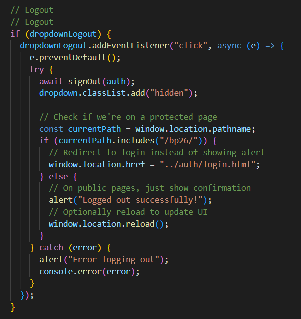
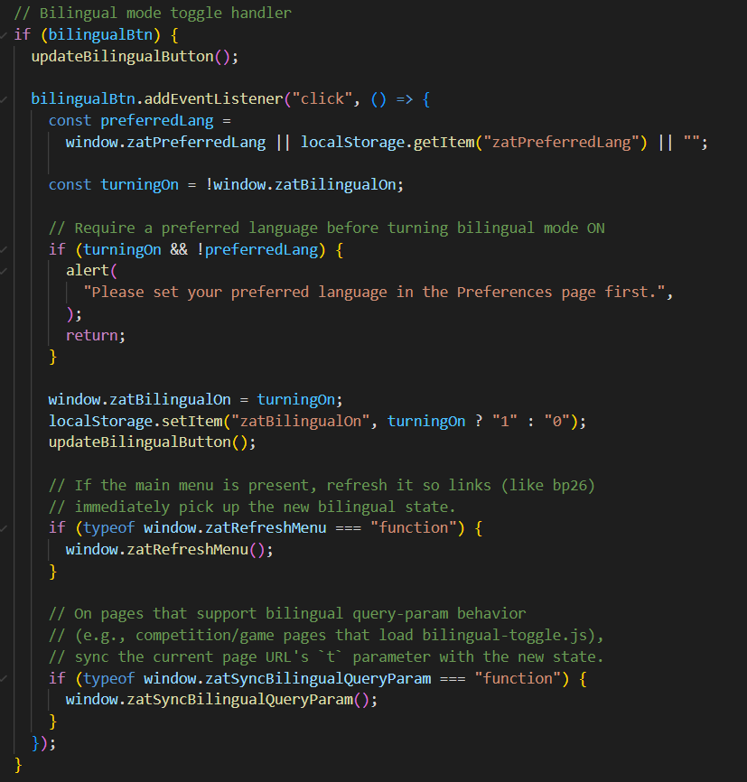

# 📘 BP26 Navigation Bar Documentation

---

## 1. What this Navigation Bar Does

The BP26 Navigation Bar is a shared header that gets loaded into every BP26 game page.

It provides:

- A clickable logo that returns to the BP26 home/index page
- Login / Sign Up buttons when the user is logged out
- A profile icon with a dropdown menu when the user is logged in
- A logout button that signs the user out and protects restricted pages
- A bilingual toggle button (only visible when logged in)



---

## 2. Files Involved (Where the Header Logic Lives)

These are the main files used for the Navigation Bar:

- `/shared/navbar.html`  
  The actual HTML markup for the header.  
  Includes the logo, login/signup area, and profile dropdown structure.

- `/js/navbar-loader.js`  
  Injects the navbar HTML into each page dynamically.

- `/js/navbar-auth.js`  
  Controls authentication UI state, dropdown behavior, logout handling, and bilingual toggle logic.

- `css/header.css`  
  Styling for the header. Included by each BP26 page.


---

## 3. How the Navbar is Added to a BP26 Page

Each BP26 game page includes a placeholder element where the header gets injected and loads the header CSS.

### Required Pattern

- A placeholder div near the top of the page:

```html
<div id="header-placeholder"></div>
```

- Header CSS loaded inside `<head>`:

```html
<link rel="stylesheet" href="css/header.css" />
```

- Page padding so content does not hide behind the fixed header:

```css
body {
  padding-top: 7%;
}
```

---

## 4. How Navbar Injection Works (Loader)

The navbar is injected dynamically using `navbar-loader.js`.

### Process

1. Looks for the mount point (`#navbar-mount`)
2. Fetches the shared navbar HTML (`/shared/navbar.html`)
3. Injects it into the page
4. Imports authentication logic and initializes it

### Key Behavior

```js
fetch("/shared/navbar.html")
```

Pulls the shared markup.

```js
import("/js/navbar-auth.js")
```

Loads authentication logic after HTML is injected.

---

## 5. Navbar HTML Structure

The header HTML provides three main UI zones.

### A) Logo
- Uses:

```html
onclick="window.location.href = './'"
```

Returns the user to the BP26 root page.

### B) Logged-Out Section
- Contains Login and Sign Up buttons inside `#logged-out`.

### C) Logged-In Section
- Profile icon container: `#logged-in`
- Dropdown menu: `#profile-dropdown` (hidden initially)
- Includes:
  - Leaderboard
  - Profile
  - Logout

### Important UX Detail
`.auth-btn` starts with `visibility: hidden` so users do not see the wrong state before Firebase authentication loads.




---

## 6. Authentication Logic (Logged Out vs Logged In)

`navbar-auth.js` uses Firebase authentication:

```js
onAuthStateChanged(auth, (user) => { ... })
```

This listens for authentication state changes.

### Logged Out State
- `#logged-out` shown
- `#logged-in` hidden
- Bilingual toggle hidden

### Logged In State
- `#logged-out` hidden
- `#logged-in` shown
- Bilingual toggle visible
- User email displayed
- Greeting uses display name or email prefix






---

## 7. Profile Dropdown Behavior

Dropdown behavior is controlled using event listeners:

- Clicking the profile icon toggles the dropdown visibility
- Clicking outside closes the dropdown



---

## 8. Logout Behavior (Protected Pages)

When Logout is clicked:

1. Calls:

```js
signOut(auth)
```

2. Checks current URL path.

- If inside `/bp26/`:
  - Redirects to `../auth/login.html`
- Otherwise:
  - Shows confirmation alert
  - Reloads the page



---

## 9. Bilingual State (localStorage)

The navbar initializes bilingual state using localStorage:

```js
localStorage.getItem("zatBilingualOn")
localStorage.getItem("zatPreferredLang")
```

These values are copied into globals:

- `window.zatBilingualOn`
- `window.zatPreferredLang`

The button updates dynamically:

- **Bilingual: On**
- **Bilingual: Off**



---

## ✅ Quick Guide — Adding the Navbar to a New BP26 Page

Checklist:

1. Include header CSS in `<head>` (`css/header.css`)
2. Add the placeholder near the top of `<body>`
3. Load the navbar loader script
4. Add page padding:

```css
body {
  padding-top: 7%;
}
```

---

## ✅ Summary

The BP26 Navigation Bar is a reusable shared component that centralizes navigation, authentication UI handling, and bilingual state management across all BP26 pages. It dynamically injects markup and synchronizes UI state with Firebase authentication to ensure consistent behavior across protected and public pages.
