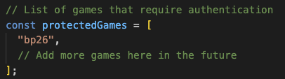
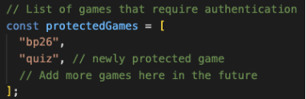
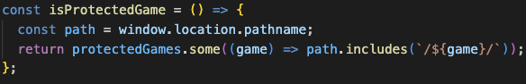
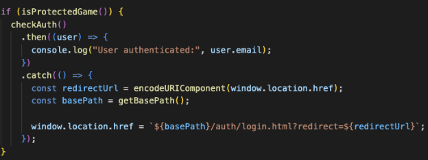
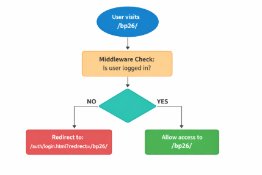
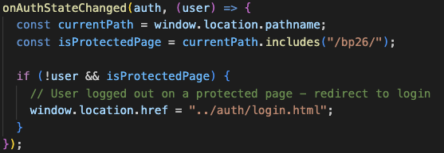
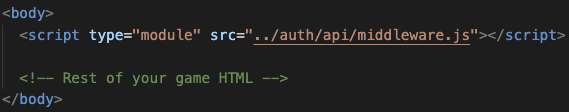

**GAME PROTECTION (MIDDLEWARE) GUIDE**\
**Last updated:** February 9, 2026

\
**What is Middleware?**\
Middleware is a security system that prevents users from accessing certain games without being logged in. Think of it like a security guard that checks if you have a ticket before letting you enter a concert venue.

**How It Works**\
The middleware does three main things:

1. Checks if the current page is a protected game
1. Verifies if the user is logged in
1. Redirects to login page if the user is not authenticated

**Protected Games List**\
At the top of auth/api/middleware.js, we define which games require authentication:\

**What this does:**

- Creates an array of game folder names that need protection
- Currently only "bp26" is protected
- To protect more games in the future, just add their folder names to this array

**Example:** To protect a new game called "quiz", add it like this:

**Checking if Current Page is Protected**\
The isProtectedGame() function checks if the user is trying to access a protected game:

**What this does:**

- Gets the current page URL path (example: /bp26/fnd.html)
- Checks if the path contains any protected game folder name
- Returns true if it's a protected game, false if it's not

\
**Example:**

User visits /bp26 → Returns true (protected)

User visits /001-sbg → Returns false (not protected)\
\
**Authentication Check and Redirect**\
This is the main protection logic that runs when a user visits a protected page:

**What this does:**

1. If the page is a protected game:
- Calls checkAuth()` to verify if user is logged in
1. If user is loggedIn, then .then() method will trigger
- Allows access to the game
- Logs the user's email to console
1. If user is NOT loggedIn , then .catch() method will trigger:
- Saves the current page URL, so we can return after login
- Redirects to login.html
- Passes the original URL as a redirect parameter

**Example Flow:**

**Monitoring Logout Events**\
This code watches for users who log out while on a protected page:

**What this does:**

- Listens for authentication state changes (login/logout)
- If user logs out while on a protected page
- Immediately redirects them to the login page

**Why this is important:** Without this, a user could:

1. Login and access bp26
1. Click logout
1. Still see the game page (security risk!)

This code prevents that by redirecting immediately on logout.

**How to Protect a New Game**

Step 1: Add the game folder name to the protectedGames array:

Step 2: Add this script tag to the game's HTML file (right after <body> tag):\

That's it! Your game is now protected.\
\
\
**Summary:**

The middleware provides game protection by:

- Checking if a page is in the protected games list
- Verifying user authentication before allowing access
- Redirecting unauthenticated users to login
- Monitoring logout events and redirecting if needed
- Easy to add protection to new games (just 2 steps)
