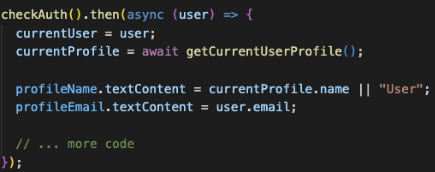
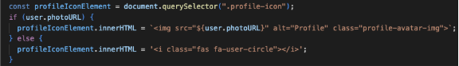
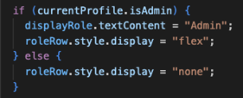
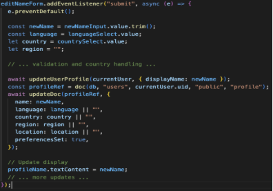
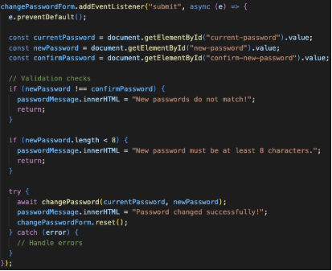
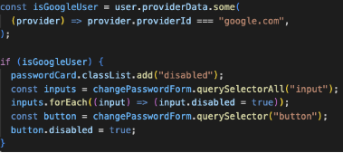
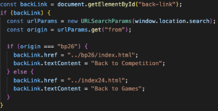

||||
| :- | :-: | -: |

**PROFILE PAGE GUIDE**\
**Last updated:** February 9, 2026

**What is the Profile Page?**\
The Profile Page allows users to view and edit their account information, including their display name, preferred language, location, and password. It's like a settings page for the user's account.\
\
**Loading User Profile Data**\
When the page loads, it fetches the user's profile information from Firebase:

**What this does:**

1. Calls checkAuth() to verify user is logged in
- If not logged in → Redirects to login page
- If logged in → Continues to load profile

1. Gets user profile data using getCurrentUserProfile()
- ` `Fetches name, language, location, etc. from Firebase
1. Displays user information:
- Name or "User" if the display name is not set yet
- Email address
- Profile photo, if user has logged in using Google, otherwise default profile icon

**Displaying Profile Photo**\
For Google users, we show their Google profile picture:

\
**What this does:**

- Checks if user has a photoURL, only Google users have this
- If yes → Shows their Google profile picture
- If no → Shows Font Awesome user icon

**Showing Admin Role**\
If the user is an admin, we display their role:

**What this does:**

- Checks if currentProfile.isAdmin is true
- If admin → Shows "Role: Admin" in profile
- If regular user → Hides the role row completely

**Editing Profile**\
When user submits the edit form, the profile updates in Firebase:

**What this does:**

1. Gets form values: 
- Display name
- Preferred language
- Country and province/state (if applicable)
1. Updates Firebase Authentication display name
1. Updates Firestore database with all profile fields
1. Updates the page display immediately without refresh
1. Shows success message to user

**Password Change Functionality**\
Users can change their password through the profile page:

**What this does:**

1. Validates password requirements: 
- New password matches confirmation
- Password is at least 8 characters
- New password is different from current
1. Calls Firebase to change password
1. Shows appropriate messages: 
   1. Success → Green message
   1. Error → Red message with specific error

**Google User Password Handling**

Users who signed in with Google cannot change their password (it's managed by Google):

**What this does:**

- Checks if user signed in with Google
- If yes → Disables entire password change section
- Prevents Google users from trying to change password

\
**Dynamic "Back to Games" Link**\
The back button changes based on where the user came from:

**What this does:**

1. Checks URL parameter “?from=bp26” or “?from=home”
1. If from BP26: 
- Button says "Back to Competition"
- Links to /bp26/index.html
1. If from anywhere else: 
- Button says "Back to Games"
- Links to /index24.html

**Why this is helpful:**\
User experience is better when they return to where they came from, not always the same page.

**Summary**\
The Profile Page provides:

- Display of user information (name, email, language, location)
- Profile editing with validation
- Smart country/province selection
- Password change functionality
- Special handling for Google users
- Dynamic back navigation
- Admin role display
- Profile photo support
||||
| :- | :-: | -: |

